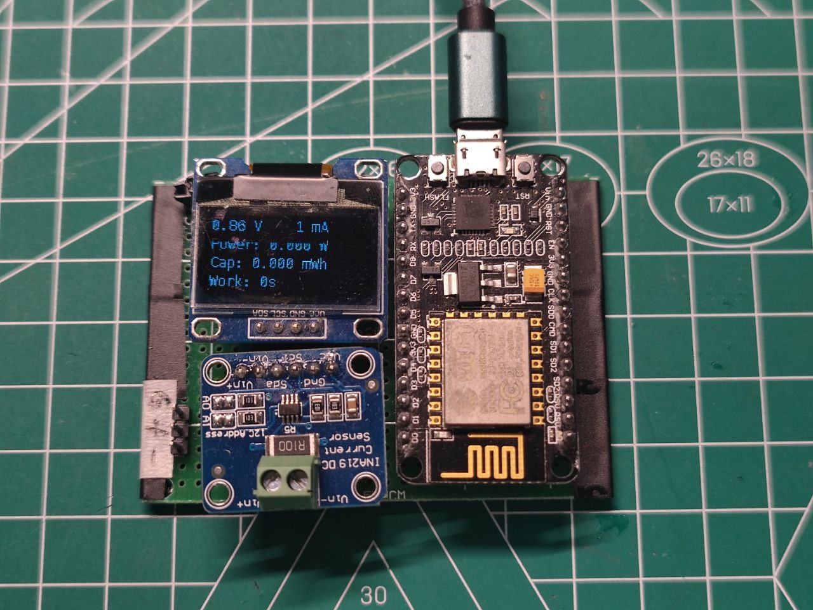
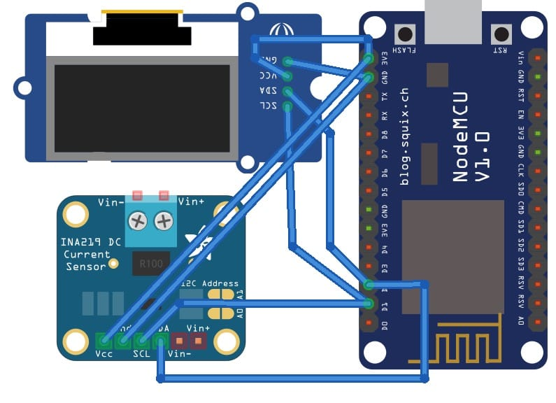
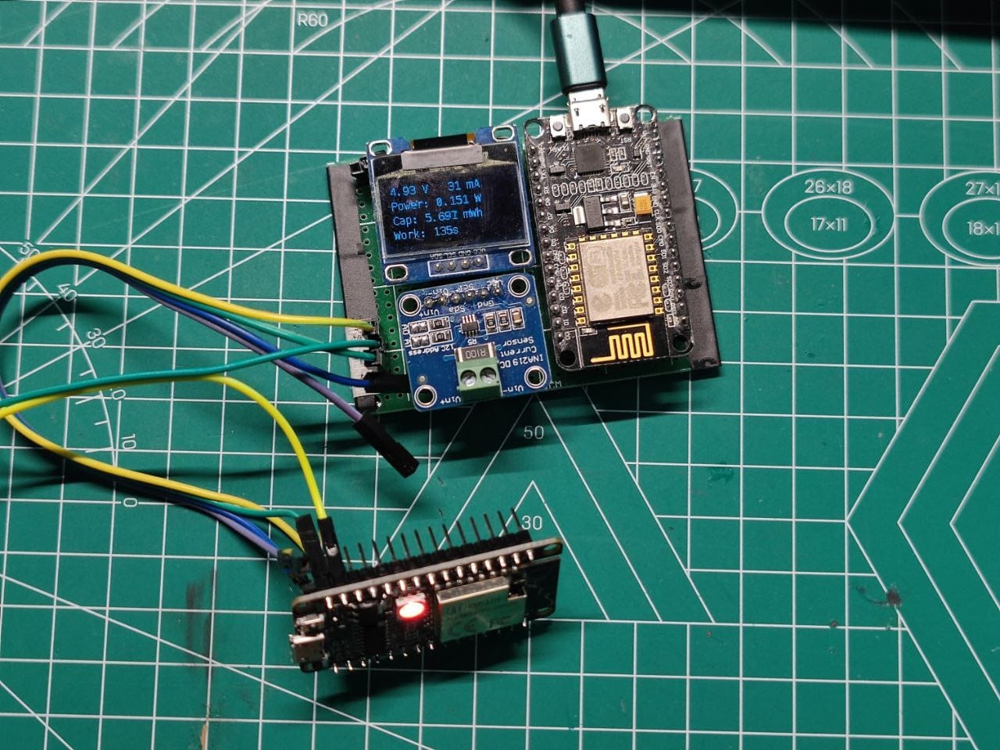
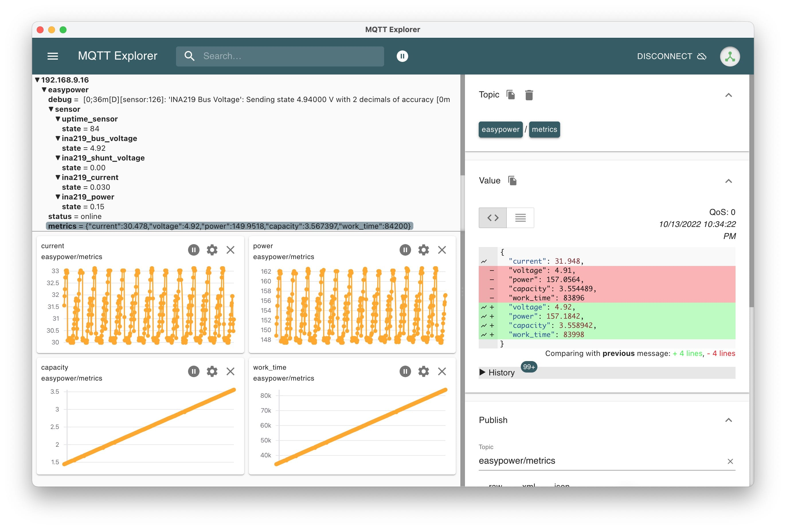

# EasyPower

EasyPower is a simple power meter powered by ESPHome.



## Features

* Measure the voltage and current of the load device
- Calculate the power of the load device in mW
- Cumulative power consumption in mWh
- Cumulative operating time to evaluate battery usage

## Hardware

* ESP8266 dev board, such as NodeMCU
* INA219 module
* 128x64 OLED module, with I2C pins

That's all!

## Wiring



## Firmware

With the power of ESPHome, we can build and upload firmware to mcu with just one line of command:

```bash
esphome upload easypower.yaml
```

If you need monitor the data trends, you should set Wi-Fi and MQTT broker information first in `secrets.yaml`:

```yaml
wifi_ssid: ""
wifi_password: ""
mqtt_broker: ""
```

## Usage

Finally, you can connect the load device which want to be measured, for example a NodeMCU:

* Connect power 5V to VIN+
* Connect VIN- to V5 on NodeMCU
* Connect power GND to NodeMCU GND
* Connect power GND to INA219 GND



## Monitor

You can use MQTT Explorer to monitor data trends across measurements, just selecting the topic `easypower/metrics`, then using "Add to chart panel" in the Value panel, aha, a data trend chart apperaed:



## License

MIT

